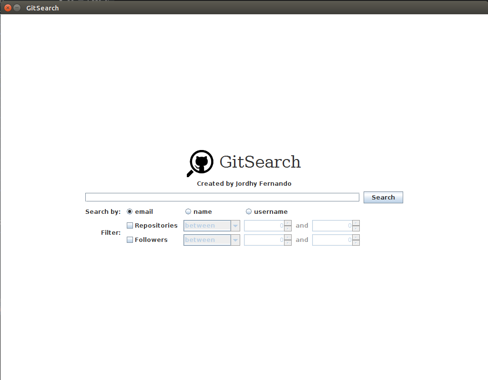
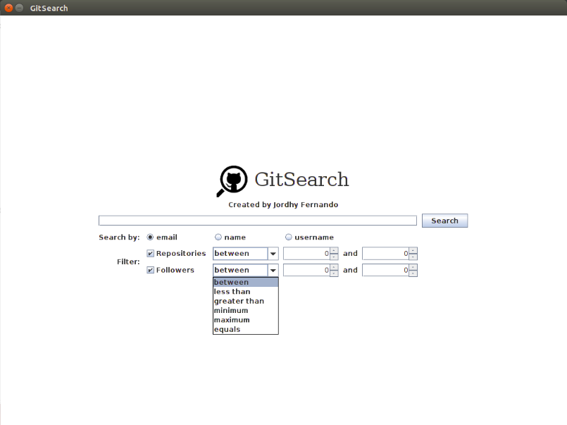
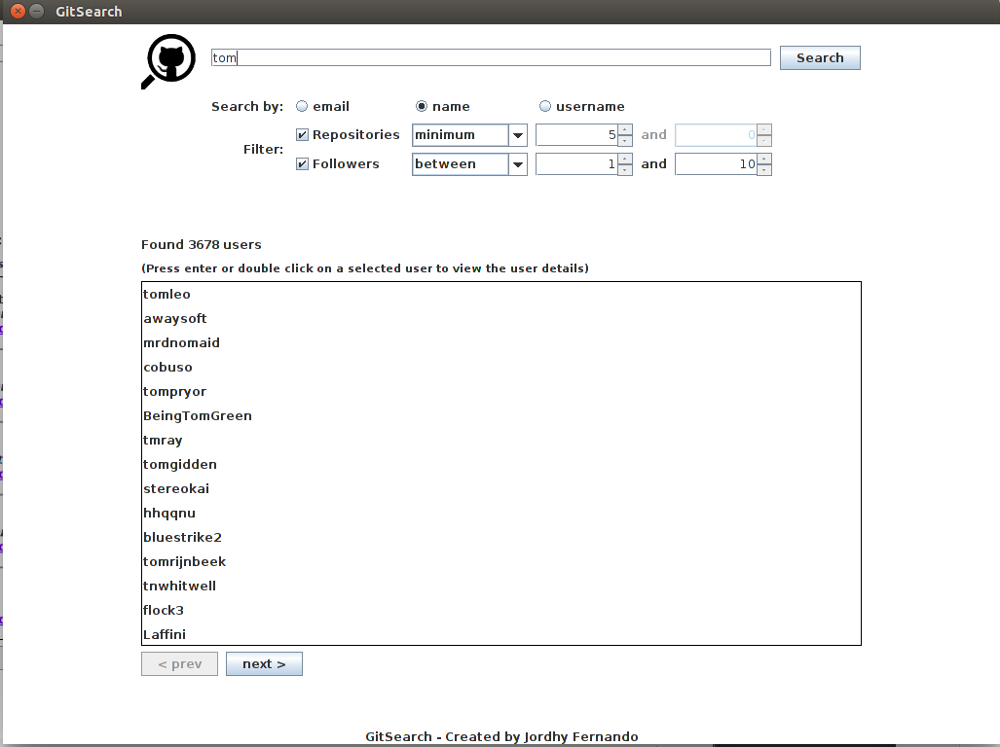
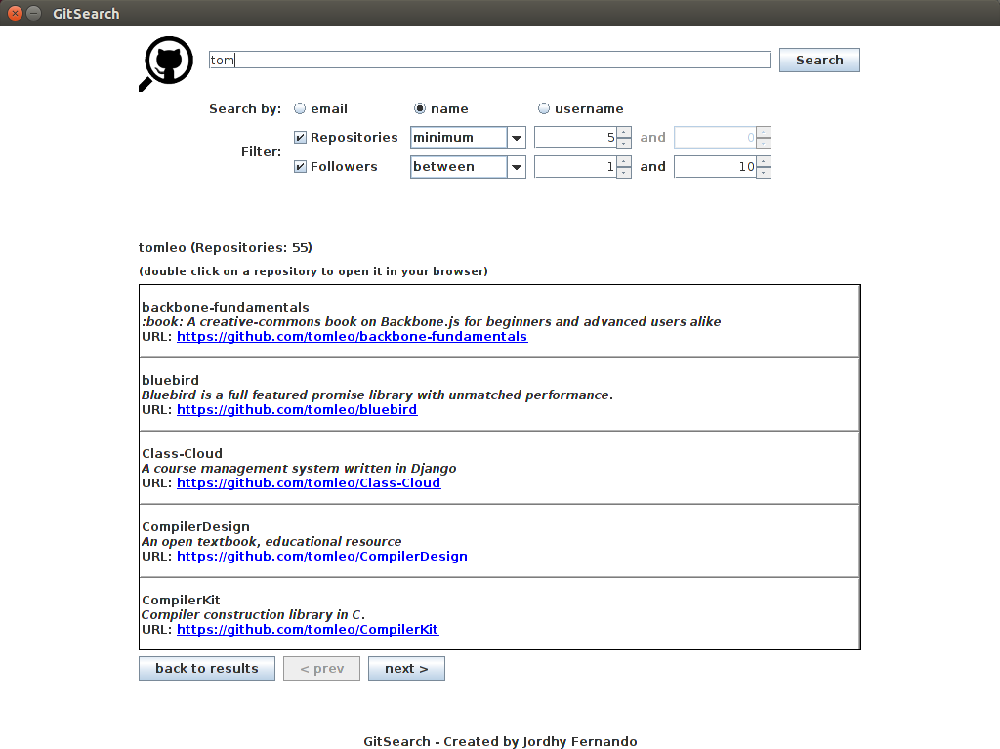
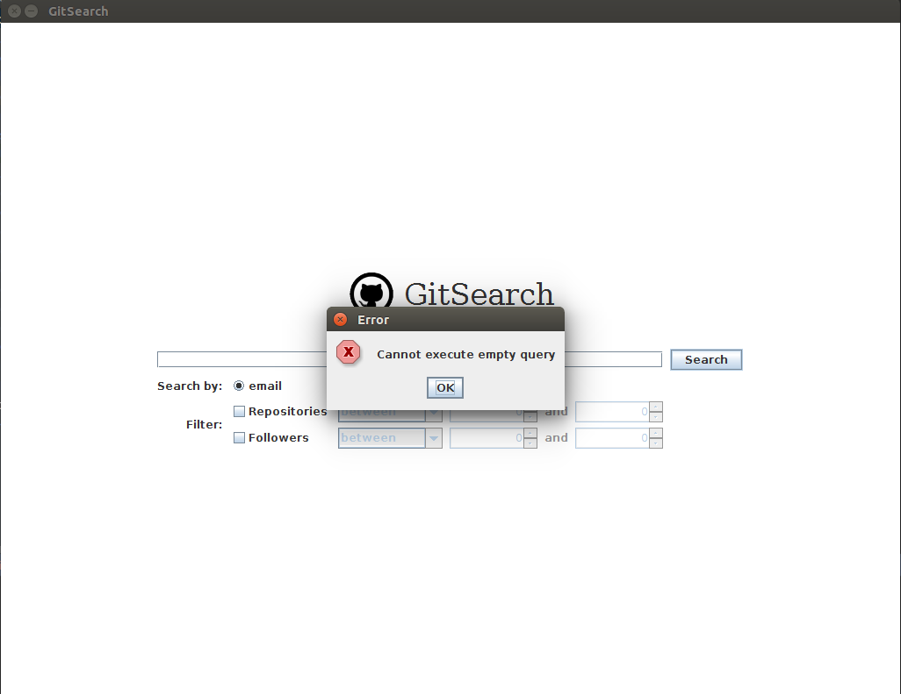
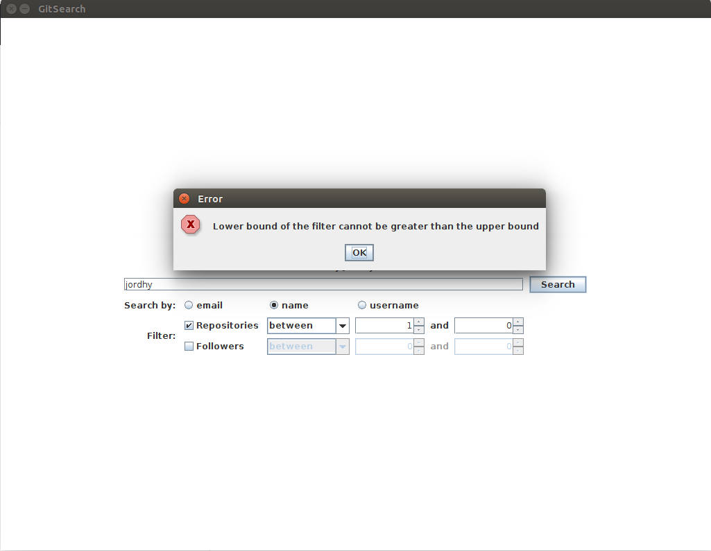
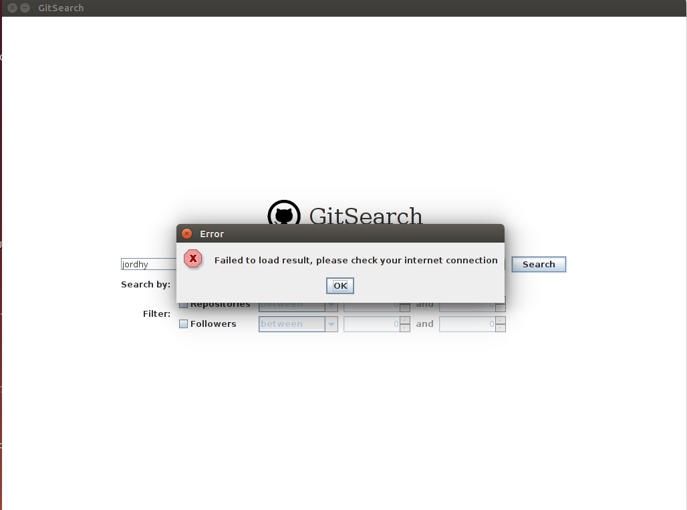

# GitSearch

Aplikasi untuk mencari pengguna GitHub, dibuat dalam bahasa Java.

Aplikasi ini menggunakan GitHub API yang diakses secara REST.

Aplikasi dapat diunduh [di sini](https://github.com/jordhy97/GitSearch/releases).

## JSON, REST, dan GitHub API

1. JSON

    JSON (*JavaScript Object Notation*) adalah format pertukaran data yang mudah dibaca/di-*parse* dan ditulis/dibuat baik oleh manusia maupun oleh komputer. JSON menggunakan format teks yang tidak bergantung pada bahasa pemrograman apapun, tetapi menggunakan konvensi yang umumnya digunakan pada keluarga bahasa pemrograman C (C, C++, Java, JavaScript, Perl, Python, dll.). Sifat JSON yang independen terhadap bahasa ini yang membuatnya menjadi format pertukaran data yang ideal. JSON terbuat dari dua struktur yaitu:

    - Sekumpulan pasangan nama/nilai yang dalam beberapa bahasa pemrograman dinyatakan sebagai objek, *record*, *struct*, kamus, tabel hash, *keyed list*, atau *associative array*.
    - Daftar nilai yang terurut yang dapat dinyatakan sebagai *array*, vektor, atau *list*.

    Format data JSON menggunakan bentuk sebagai berikut.
   
    - Objek (sekumpulan nama/nilai yang tidak terurut). Objek diawali dengan { (kurawal buka) dan diakhiri dengan } (kurawal tutup). Setiap nama diikuti tanda : (semicolon) kemudian nilainya dan antar pasangan nama/nilai dipisahkan dengan , (koma).
    - *Array* (kumpulan nilai terurut). *Array* diawali dengan [ (kurung siku buka) dan diakhiri dengan ] (kurung siku tutup). Antara nilai yang satu dengan yang lain dipisahkan dengan , (koma).
    - Nilai. Nilai dapat berupa string (menggunakan tanda kutip dua), bilangan, nilai kebenaran (*true* atau *false* atau *null*), objek maupun *array*.

2. REST
  
    REST (*Representational State Transfer*) adalah standar arsitektur komunikasi berbasis web yang umumnya menggunakan protokol HTTP untuk melakukan pertukaran data. Pada REST, REST server menyediakan akses ke *resources* (data) yang kemudian akan akan diakses oleh REST client untuk digunakan. Setiap *resource* diidentifikasi oleh URI (*Universal Resource Identifiers*) dan direpresentasikan dalam bentuk format teks, JSON, atau XML. Saat REST client melakukan *request*, metode yang umumnya digunakan adalah metode yang terdapat pada HTTP yang diantaranya adalah GET (*read only resource*), PUT (membuat *resource* baru), DELETE (menghapus *resource*), POST (meng-*update resource*), dan OPTIONS (melakukan operasi yang didukung oleh *resource*). 
  
    *Web services* yang berbasis arsitektur REST disebut sebagai RESTful *web services*. Cara kerja *web service* ini adalah client melakukan sebuah *request* melalui HTTP Request kemudian server merespon melalui HTTP Response. HTTP Request terdiri dari metode yang digunakan untuk melakukan *request*, versi HTTP yang digunakan, metadata untuk HTTP Request (*Request Header*), dan konten dari *request* (*Request Body*). Sedangkan HTTP Response terdiri dari status server(*Response Code*), versi HTTP yang digunakan, metadata untuk HTTP Response (*Response Header*), dan konten dari data yang diberikan (*Response Body*).
  
    Pada arsitektur REST, status dari client tidak disimpan di server. Batasan ini disebut sebagai *Statelessness*. Dengan batasan ini, *web services* dapat melayani masing-masing *request* secara independen, dan tidak perlu menjaga state dari pengguna yang membuat desain aplikasi menjadi lebih sederhana serta meningkatkan performansi dari aplikasi.

3. GitHub API
    
	GitHub API adalah API (*Application Program Interface*) yang disediakan oleh GitHub untuk mengakses *resources* (data) yang terdapat pada GitHub. GitHub API dapat diakses dari https://api.github.com dan pengaksesannya dilakukan secara REST. Semua data diterima dan dikirim dalam format JSON. Ketika pengambilan data dilakukan pada sebuah *resource* tertentu, data akan dikirimkan dalam representasi detil (semua atribut diberikan) dan ketika data yang diambil berupa kumpulan *resources*, data akan dikirimkan dalam representasi yang berupa ringkasan (tidak semua atribut diberikan) karena akan membutuhkan waktu lebih lama untuk mengambil detil seluruh *resources* yang ingin diambil. 
	
	Pada aplikasi ini, API yang akan digunakan adalah GitHub Search API. GitHub Search API digunakan untuk melakukan pencarian spesiik terhadap suatu item berdasarkan query yang dimasukkan, misalnya pengguna, file dalam repository, dll. Untuk setiap pencarian hasil yang didapatkan dari GitHub Search API jumlahnya maksimal adalah 1000 dan diurutkan berdasarkan hasil yang paling cocok (kecuali dispesifikasikan pada parameter query). Untuk *requests* yang telah terautentikasi dapat dilakukan sebanyak 30 *requests* tiap menitnya dan untuk yang tidak terautentikasi maksimalnya adalah 10 *requests* per menit.  
	
	Detil lengkap mengenai GitHub API dapat dilihat di https://developer.github.com/v3/ dan untuk GitHub Search API dapat dilihat di https://developer.github.com/v3/search/.

## Fitur Aplikasi

1. **GitSearch** dapat melakukan pencarian pengguna GitHub berdasarkan username, email, atau nama pengguna (untuk setiap pencarian dipilih salah satu dari pilihan yang tersedia).

2. Pencarian dapat difilter berdasarkan jumlah repository dan jumlah follower dengan cara mencentang checkbox yang bersesuaian dengan filter yang ingin digunakan (*default*-nya filter tidak digunakan).
Jumlah repository dan jumlah follower dapat difilter untuk berada pada rentang nilai tertentu, kurang dari nilai tertentu, lebih dari nilai tertentu, sama dengan nilai tertentu, minimal berada pada nilai tertentu, atau maksimal berada pada nilai tertentu. Jenis filter ini dapat dipilih pada combobox yang telah disediakan. Jika nilai yang dimasukkan bukan angka, nilai tersebut akan diganti menjadi 0.

3. Ketika menekan tombol **Search** atau **enter** pada keyboard, **GitSearch** akan menampilkan jumlah pengguna GitHub yang ditemukan serta daftar username pengguna GitHub tersebut. **GitSearch** akan menampilkan maksimal **15** username pengguna Github per halaman pencariannya. Halaman pencarian dapat dinavigasi dengan menggunakan tombol **previous** dan **next** yang disediakan.

4. Pada saat username salah satu pengguna GitHub diklik dua kali atau dipilih kemudian menekan tombol **enter** pada keyboard, **GitSearch** akan menampilkan detil pengguna GitHub tersebut yang berupa username-nya, jumlah repository yang dimilikinya, dan detil setiap repository tersebut (nama, deskripsi, dan URL). Jumlah repository yang ditampilkan maksimal **5** per halamannya dan halaman dapat dinavigasi dengan menggunakan tombol **previous** dan **next** yang disediakan. **GitSearch** juga dapat menampilkan kembali halaman pencarian sebelumnya (halaman pencarian di mana terdapat username pengguna GitHub yang dipilih) dengan menggunakan tombol **back to results**. Ketika sebuah repository diklik dua kali, **GitSearch** akan membuka repository tersebut di browser jika memungkinkan.

5. **GitSearch** akan menampilkan pesan kesalahan jika terjadi kesalahan saat pencarian. Kesalahan yang mungkin terjadi yaitu pengguna memasukkan keyword kosong, pengguna menggunakan filter dengan rentang di mana batas bawahnya lebih besar daripada batas atasnya, atau tidak adanya koneksi internet.

## Dokumentasi
Dokumentasi kode program dapat dilihat [di sini](https://jordhy97.github.io/GitSearch/doc/Javadoc/index.html).

Diagram kelas dapat dilihat [di sini](https://jordhy97.github.io/GitSearch/doc/class_diagram/class_diagram_classes_only.png) (hanya nama kelas saja) dan [di sini](https://jordhy97.github.io/GitSearch/doc/class_diagram/class_diagram_full.png) (diagram kelas lengkap).